# MyCampusHub 🎓

**MyCampusHub** is an enterprise-grade campus management system designed to streamline academic operations, social connectivity, and utility management for modern educational institutions. Built with a robust **Node.js/Prisma** backend and a high-performance **React Native (Expo)** frontend, it delivers a premium, seamless experience for students and faculty.

## 🚀 Features

### 📚 Academic Excellence
- **Expert Roadmap**: Visualize your entire semester with a connected, step-by-step learning path.
- **Curriculum Tracker**: Real-time tracking of credits, lectures, and lab hours.
- **Faculty & Mentors**: Direct access to faculty profiles and assigned mentorship details.

### 🏛️ Campus Life
- **Digital Campus**: Virtual tour of world-class facilities and institute highlights.
- **Events Hub**: Stay updated with technical, cultural, and sports events.
- **Mess & Hostel**: Live menus, hostel attendance, and utility management.

### 🔐 Security & Utilities
- **Secure Authentication**: Robust JWT-based login/signup flow.
- **Responsive Design**: Optimized for all screen sizes with a custom scaling engine.
- **Offline Resilience**: Graceful error handling and retry mechanisms.

---
## 🎥 Demo & Highlights

### Application Walkthrough
> [Click here to watch the full video demo](https://drive.google.com/file/d/1BJ2kaQMza9sYbJsvF4BrAa-VS_6lqLZa/view?usp=sharing)

### 📸 Screenshots

| | | | |
|:---:|:---:|:---:|:---:|
| 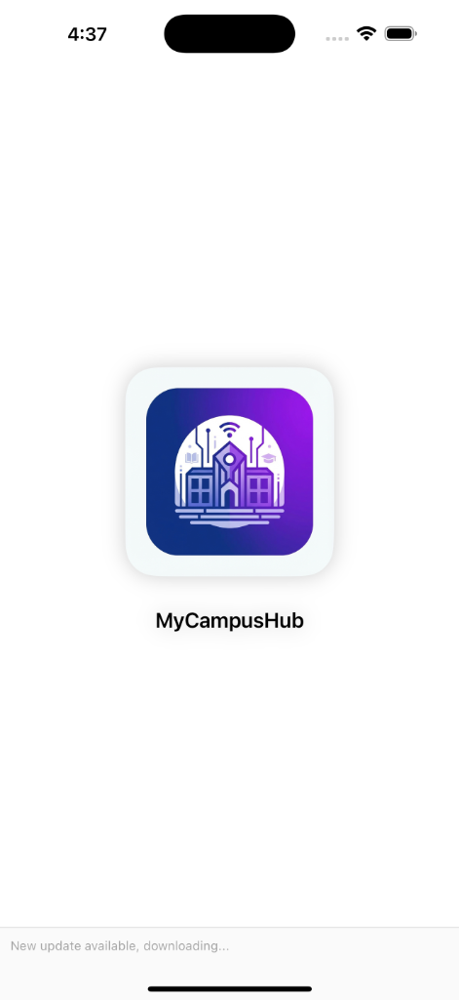 | 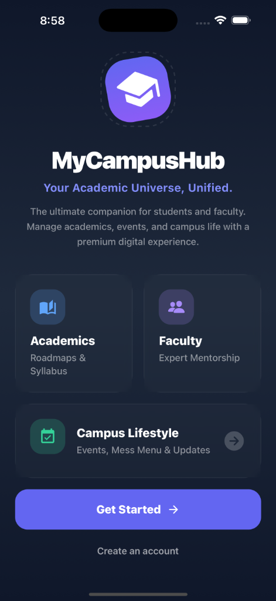 | 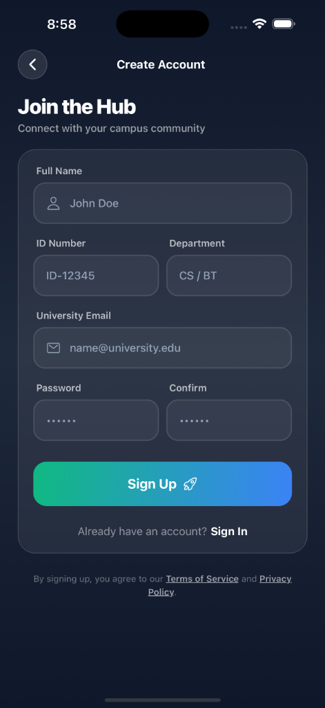 | 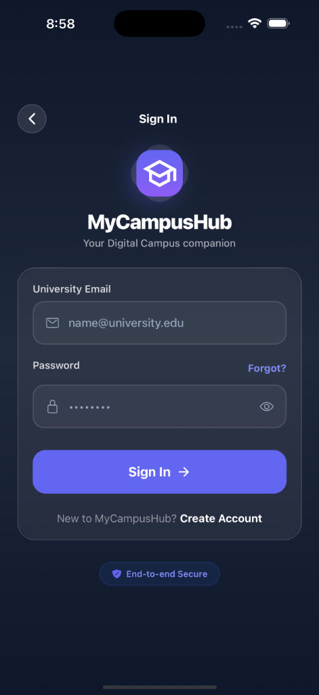 |
|  | 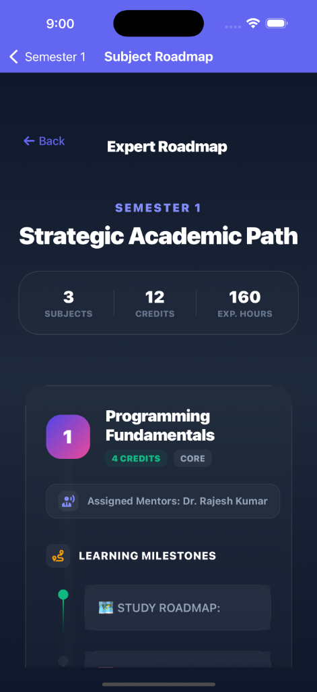 | 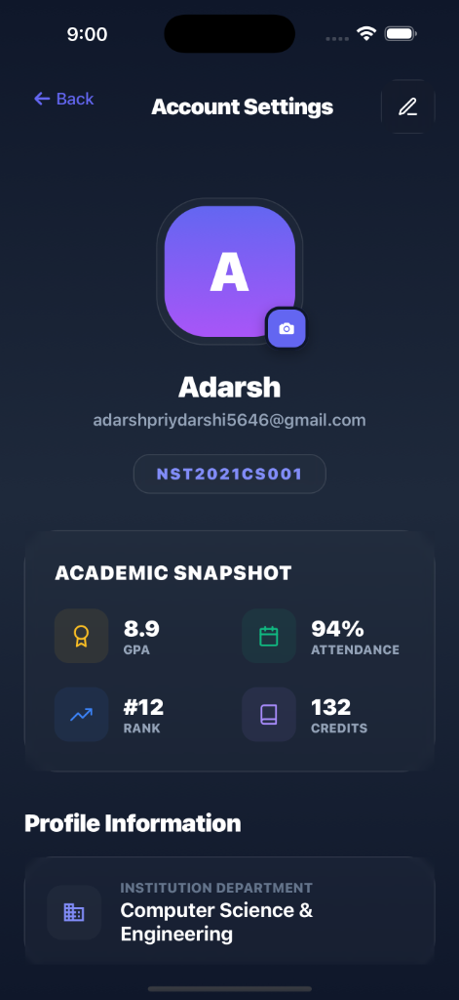 | 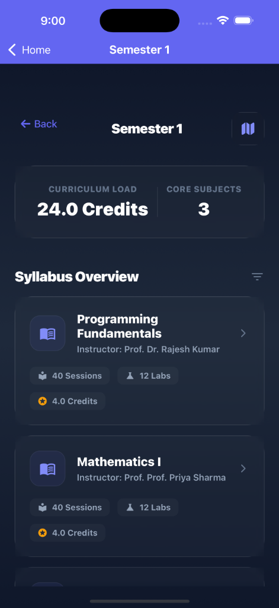 |
| 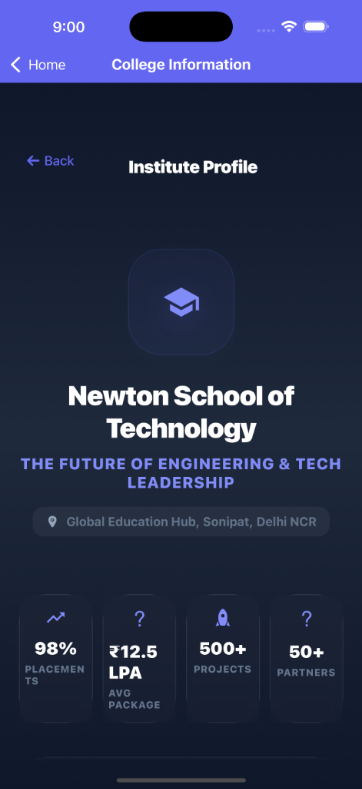 | 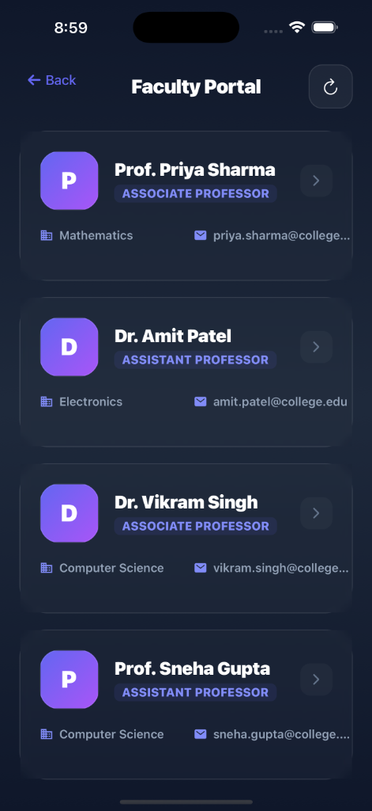 | 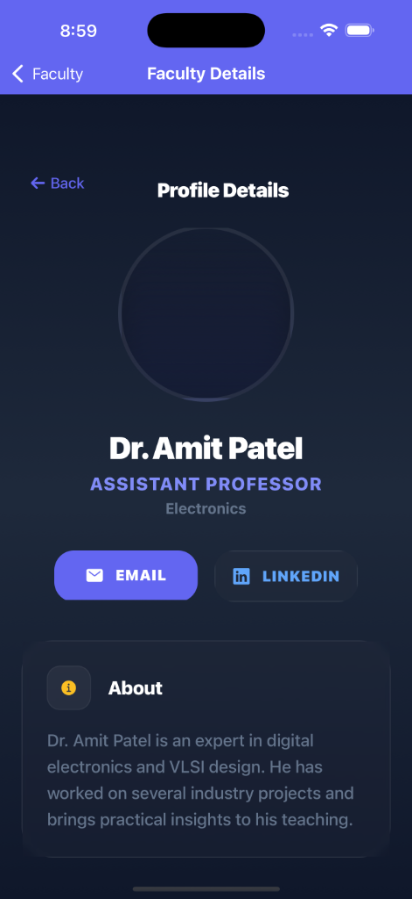 | 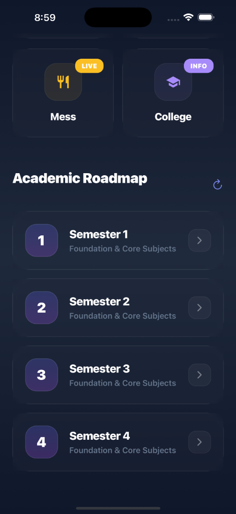 |
| 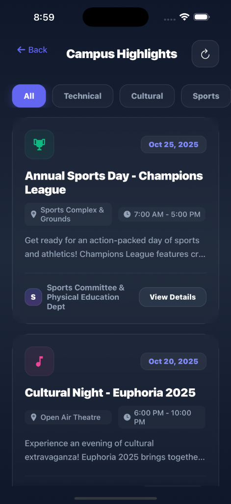 | | | |

---

## 🛠️ Technology Stack

- **Frontend**: React Native, Expo, Reanimated, BlurView
- **Backend**: Node.js, Express, Prisma ORM
- **Database**: PostgreSQL (via Prisma)
- **Styling**: Custom Design System (GlobalStyles), Tailwind-inspired utility tokens
- **Architecture**: MVC (Backend), Component-Based (Frontend)

---

## 📂 Project Structure

```bash
MyCampusHub/
├── backend/            # Express API & Prisma Schema
│   ├── controllers/    # Logic for Academics, Auth, Events
│   ├── prisma/         # Database Models & Migrations
│   └── routes/         # API Endpoint Definitions
│
└── frontend/           # React Native App
    ├── screens/        # UI Screens (College, Events, Roadmap...)
    ├── components/     # Reusable UI (Cards, Badges, Headers)
    ├── services/       # API Integration (Axios)
    ├── styles/         # Global Design System
    └── utils/          # Responsive Scaling Helpers
```

## 🚀 Getting Started

### Prerequisites
- Node.js (v18+)
- PostgreSQL Database
- Expo Go App (for mobile testing)

### Installation

1. **Clone the Repository**
   ```bash
   git clone https://github.com/your-org/mycampushub.git
   cd MyCampusHub
   ```

2. **Setup Backend**
   ```bash
   cd backend
   npm install
   npx prisma migrate dev  # Initialize DB
   npm run dev             # Start Server on Port 3001
   ```

3. **Setup Frontend**
   ```bash
   cd ../frontend
   npm install
   npx expo start -c       # Start Metro Bundler
   ```

---

## 🤝 Contribution

We follow strict coding standards. Please run lint checks before pushing.
1. Fork the repo.
2. Create your feature branch (`git checkout -b feature/AmazingFeature`).
3. Commit your changes (`git commit -m 'Add some AmazingFeature'`).
4. Push to the branch (`git push origin feature/AmazingFeature`).

---

**© 2025 MyCampusHub Team.** Built for the Future of Education.
